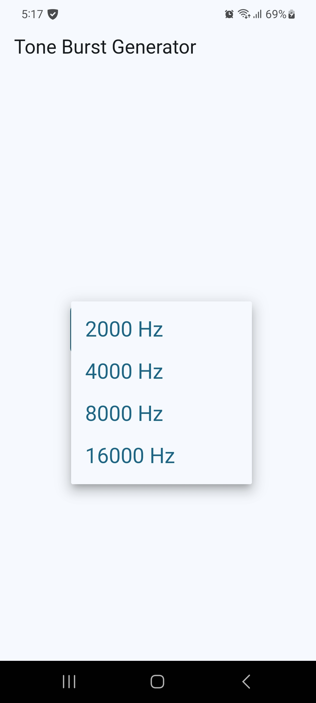
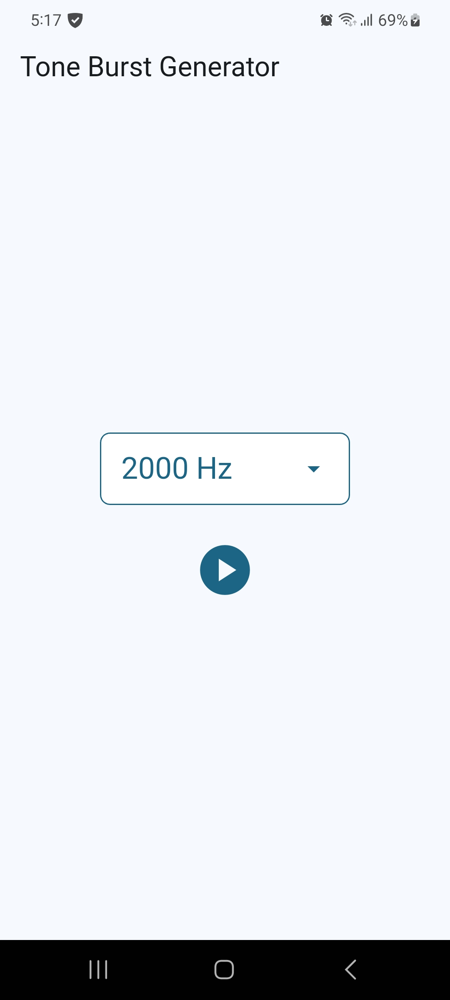

<h1 align=center>
    <a href="https://github.com/ryo-furukawa-1122/Tone-Burst-Generator">
        
    </a>
    <br>
    Tone Burst Generator
</h1>

A new Flutter project.

## Usage
1. Select the frequency of the sound
2. Touch "play" botton

<div style="display: flex; flex-direction: column; justify-content: center">
    <div style="padding: 24px; display: flex; justify-content: center">
        
    </div>
    <div style="padding: 24px; display: flex; justify-content: center">
        
    </div>
</div>

## Install 
```
$ flutter build apk
```
```
$ flutter devices
```
```
$ flutter install -d [device name]
```

## Update icon
```
$ flutter pub run flutter_launcher_icon:main
```
## Getting Started

This project is a starting point for a Flutter application.

A few resources to get you started if this is your first Flutter project:

- [Lab: Write your first Flutter app](https://docs.flutter.dev/get-started/codelab)
- [Cookbook: Useful Flutter samples](https://docs.flutter.dev/cookbook)

For help getting started with Flutter development, view the
[online documentation](https://docs.flutter.dev/), which offers tutorials,
samples, guidance on mobile development, and a full API reference.
